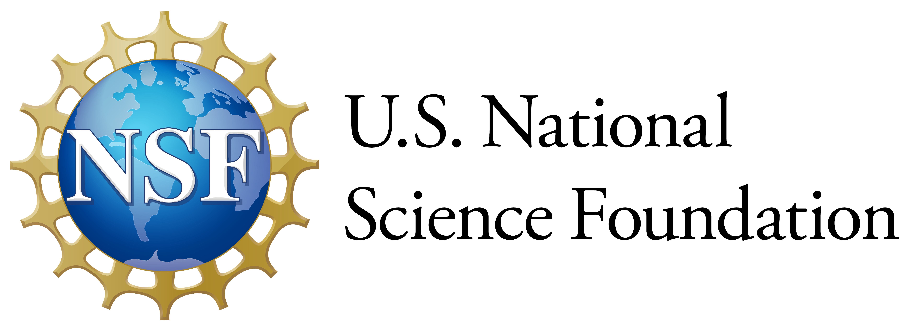
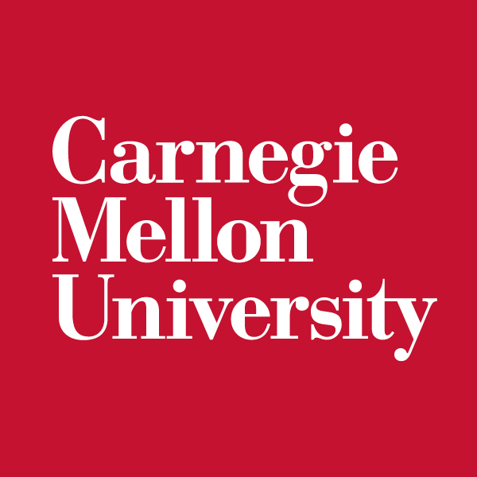

McCourt School of Public Policy\
125 E St NW\
Washington, DC 20001

<!-- ## 📢**Call for Participation - 12/15 Deadline**📢

Are you doing amazing work related to data privacy or public policy? We are  accepting abstract submissions for oral, lightning, and poster presentations, and the deadline is December 15, 2025 11:59 PM EST. Refer to the [call for participation](participation.qmd) page for all the details. -->

## **Privacy and Public Policy Conference**

The inaugural conference in 2024 was an enormous success (see details [here](prev_yrs/2024_index.qmd)) and we are thrilled to be able to come back for another round. The goal of this conference is to foster and enhance collaboration among privacy experts, researchers, data stewards, data practitioners, and public policymakers. This event serves as a crucial platform to bridge communication gaps across these diverse groups and collectively explore technical and policy solutions for addressing challenges related to data privacy and public policy.

<!-- Registration for the conference is now open! Please refer to the [registration page](registration.qmd) for more information. -->

If you would like to receive announcements about this conference and future PPPCs send an email to privacy.and.public.policy.conference@proton.me and ask to be added to the PPPC google group.

## **Program Structure**

The conference committee is currently in the process of planning a two-day conference with a single-track format. The event will commence with an invited panel of speakers who will discuss the current state of data privacy, where we're headed, and what hurdles need to be tackled. The rest of the day will be filled with presentations from privacy and public policy experts about the research and work they're currently engaged. In the evening, we are excited to host a poster session, complete with prizes for the best poster presentations.  The second day will continue with additional presentations and opportunities to network .

Please direct any questions about the conference or submission process to privacy.and.public.policy.conference@proton.me.

## **Conference Timeline**

-   **Announcement for Participation and Conference:** November 2025.

-   **Abstract Submission Deadline:** December 15, 2025.

-   **Abstract Notification:** Late December, 2025.

-   **General Registration Opens:** December 1, 2025.

-   **General Registration Deadline:** January 15, 2026 (may close earlier due to space restrictions).

<!-- -   **Presenter Registration Deadline:** TBD. -->

## **Thank you to our sponsors**

::: {layout="[[75, 25], [70]]"}

-01.jpg)
:::
