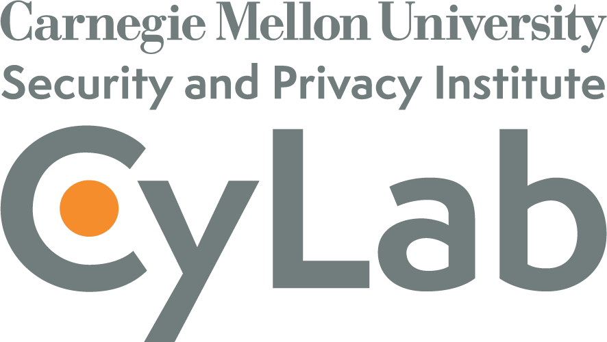

McCourt School of Public Policy\
125 E St NW\
Washington, DC 20001

<!-- ## 📢**Call for Participation - 12/15 Deadline**📢

Are you doing amazing work related to data privacy or public policy? We are  accepting abstract submissions for oral, lightning, and poster presentations, and the deadline is December 15, 2025 11:59 PM EST. Refer to the [call for participation](participation.qmd) page for all the details. -->

## **Privacy and Public Policy Conference**

The second PPPC was held in February of 2026, and just like the [inaugural conference in 2024](prev_yrs/2024_index.qmd), we were thrilled to bring together privacy experts, researchers, data stewards, data practitioners, and public policymakers to foster meaningful discussion and collaboration. The event served as a crucial platform to bridge communication gaps across these diverse groups and collectively explore technical and policy solutions for addressing challenges related to data privacy and public policy. If you were not able to attend, feel free to check out the photos below and abstracts and slides available in the [detailed program](schedule.qmd#full-program) to get a flavor of the numerous outstanding projects that were presented and discussed.

If you were able to attend any part of the conference, we would appreciate it if you would fill out the [Post-Conference Survey](https://forms.gle/T6D5ywRcXSYfnmF29) by March 13th to let us know what aspects went well, where things can be improved, and if you are interested in helping plan the next PPPC.

<!-- Registration for the conference is now open! Please refer to the [registration page](registration.qmd) for more information. -->

If you would like to receive announcements about future PPPCs, please send an email to privacy.and.public.policy[at]gmail.com and ask to be added to the PPPC google group. For those that are interested in helping out with the next PPPC (for example by reviewing submissions, being involved in the planning/programming committees, or even sponsoring) you may also email privacy.and.public.policy@gmail.com to get involved.

::: {.panel-fill layout="[[0.56, 1, 1], [1, 1], [0.87, 1, 0.49]]"}
{group="gallery" description="Welcoming attendees to the second Privacy and Public Policy Conference."}

{group="gallery" description="The opening panel on day one consisting of Yaw Etse, Joe Calandrino, and Naomi Lefkovitz and moderated by Sharron Gibbons."}

{group="gallery" description="Prof. Amin Rahimian presenting work on *Differential Privacy for Network Connectedness Indices* in the day one session __New Methods for Differentially Private Estimation and Learning__."}

{group="gallery" description="The policy panel on day two consisting of Alan McQuinn and Dylan Irlbeck, and moderated by Tatiana Rice."}

{group="gallery" description="Shlmoi Hod presenting work on *Full-Stack Privacy Risk Assessment* in the day two session __From PETs to Practice: Infrastructure and Applications__."}

{group="gallery" description="The PPPC attendees on day two gather for an end of conference photograph."}

{group="gallery" description="The members of the Programming and Planning Committees responsible for organizing the PPPC. From right to left: Ella Blue, Stephanie Straus, Elan Segarra (Programming Chair), Luca Sartore, Minsun Riddles, Saki Kinney, Sarah Scheffler (Planning Chair), and Lacey Strahm. Additional planning committee members not pictured include Amy O'Hara and Matt Williams."}

{group="gallery" description="The winner of the student poster contest, Kevin Eng, with his poster on *Valid Inference Under Data Swapping*."}
:::

## **Program Structure**

The conference committee put together a two-day conference with a single-track format. The event started with an invited panel of speakers who discussed the current state of data privacy, where we're headed, and what hurdles need to be tackled. The rest of day one was filled with presentations from privacy and public policy experts about novel methods in differential privacy and new concepts in the data privacy space. The afternoon and evening featured lightning talks and a poster session involving numerous projects with topics ranging from privacy methods, to legal considerations, to data governance, and even new modes of data access. 

The second day began with an engaging policy panel discussing the existing privacy regulation environment and ongoing work to modernize laws. The rest of day two included sessions on the realities of privacy regulations as well as examples of privacy enhancing technologies and tools being applied to real world situations. Check out the [full program](schedule.qmd) for more details, including abstracts and slides, on all the work presented at this past PPPC.

Please direct any questions about the conference to privacy.and.public.policy[at]gmail.com.

## **Conference Timeline**

-   **Announcement for Participation and Conference:** November 2025.

-   **Abstract Submission Deadline:** December 15, 2025.

-   **Abstract Notification:** Late December, 2025.

-   **General Registration Opens:** December 1, 2025.

-   **General Registration Deadline:** January 15, 2026 (may close earlier due to space restrictions).

<!-- -   **Presenter Registration Deadline:** TBD. -->

## **Thank you to our sponsors**

::: {layout="[[62, 38], [70]]"}

-01.jpg)
:::
