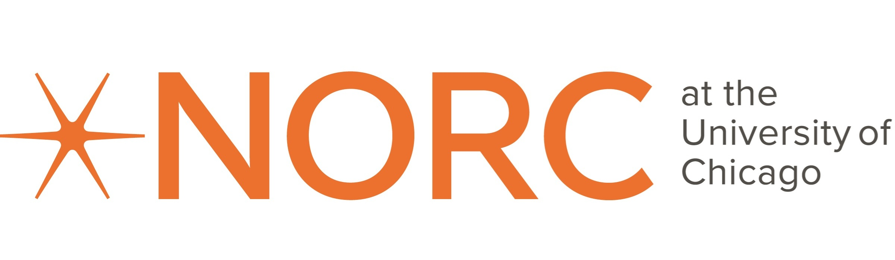

McCourt School of Public Policy\
125 E St NW\
Washington, DC 20001

## 2024 Privacy and Public Policy Conference

The goal of this conference was to foster and enhance collaboration among privacy experts, researchers, data stewards, data practitioners, and public policymakers. This event serves as a crucial platform to bridge communication gaps across these diverse groups and collectively explore technical and policy solutions for addressing challenges related to data privacy and public policy.

The conference occurred over two days in a single-track format. The event commenced with an invited panel of speakers who discussed the practical implementation of various data privacy laws followed by a series of speakers presenting work related to data privacy or policy. In the evening, we hosted a poster session, complete with prizes for the best poster presentations. On the second day, following additional presentations, we wrapped up the event with engaging roundtable discussions. See the [full 2024 program](2024_index.qmd#program) for more detail.

## Conference Timeline

-   **Announcement for Participation and Conference:** November 2023.
-   **Abstract Submission Deadline:** February 29, 2024.
-   **Reviews Completion:** April 8, 2024.
-   **Abstract Notification:** April 15, 2024.
-   **Program Announcement:** May 10, 2024.
-   **General Registration Opens:** May 20, 2024.
-   **Presenter Registration Deadline:** May 31, 2024.
-   **General Registration Deadline:** August 2, 2024.

## Full Program {#program}

+-------------------+--------------------------------------------------------------------------------------------------------------------------------------------------------------------------------------------------------------------------------------------------------------------------------------------------------------------------------------------------------------------------------------------------------------------------------------------------------------------------------------------------------------------------------------------------------------------------------------------------------------------------------------------------------------------------------------------------------------------------------------------------------------------------------------------------------------------------------------------------------------------------------------------------------------------------------------------------------------------------------------------------------------------------------------------------------------------------------------------------------------------------------------------------------------------------------------------------------------------------------------------------------------------------------------------------------------------------------------------------------------------------------------------------------------------------------------------------------------------+
| Day 1             | Friday September 13, 2024                                                                                                                                                                                                                                                                                                                                                                                                                                                                                                                                                                                                                                                                                                                                                                                                                                                                                                                                                                                                                                                                                                                                                                                                                                                                                                                                                                                                                                          |
+===================+:===================================================================================================================================================================================================================================================================================================================================================================================================================================================================================================================================================================================================================================================================================================================================================================================================================================================================================================================================================================================================================================================================================================================================================================================================================================================================================================================================================================================================================================================================+
| 8:45am - 9:00am   | Introduction                                                                                                                                                                                                                                                                                                                                                                                                                                                                                                                                                                                                                                                                                                                                                                                                                                                                                                                                                                                                                                                                                                                                                                                                                                                                                                                                                                                                                                                       |
+-------------------+--------------------------------------------------------------------------------------------------------------------------------------------------------------------------------------------------------------------------------------------------------------------------------------------------------------------------------------------------------------------------------------------------------------------------------------------------------------------------------------------------------------------------------------------------------------------------------------------------------------------------------------------------------------------------------------------------------------------------------------------------------------------------------------------------------------------------------------------------------------------------------------------------------------------------------------------------------------------------------------------------------------------------------------------------------------------------------------------------------------------------------------------------------------------------------------------------------------------------------------------------------------------------------------------------------------------------------------------------------------------------------------------------------------------------------------------------------------------+
| 9:00am - 10:00am  | **Invited panel - “Best Practices for Sharing Data & Future Implications for Other Domains”**                                                                                                                                                                                                                                                                                                                                                                                                                                                                                                                                                                                                                                                                                                                                                                                                                                                                                                                                                                                                                                                                                                                                                                                                                                                                                                                                                                      |
|                   |                                                                                                                                                                                                                                                                                                                                                                                                                                                                                                                                                                                                                                                                                                                                                                                                                                                                                                                                                                                                                                                                                                                                                                                                                                                                                                                                                                                                                                                                    |
|                   | Temilola Afolabi at CODE, Kelsey Finch at Snowflake, Gabe Kaptchuk at University of Maryland, and Nawar Shara at Georgetown University                                                                                                                                                                                                                                                                                                                                                                                                                                                                                                                                                                                                                                                                                                                                                                                                                                                                                                                                                                                                                                                                                                                                                                                                                                                                                                                             |
|                   |                                                                                                                                                                                                                                                                                                                                                                                                                                                                                                                                                                                                                                                                                                                                                                                                                                                                                                                                                                                                                                                                                                                                                                                                                                                                                                                                                                                                                                                                    |
|                   | (panelists' bios at the the end)                                                                                                                                                                                                                                                                                                                                                                                                                                                                                                                                                                                                                                                                                                                                                                                                                                                                                                                                                                                                                                                                                                                                                                                                                                                                                                                                                                                                                                   |
|                   |                                                                                                                                                                                                                                                                                                                                                                                                                                                                                                                                                                                                                                                                                                                                                                                                                                                                                                                                                                                                                                                                                                                                                                                                                                                                                                                                                                                                                                                                    |
|                   | The sharing of administrative and survey data are important for understanding various policy outcomes, but such increased data access for research and public policy requires the framework of various regulations that seek to ensure patient privacy. For example, various laws and regulations, such as the [Health Insurance Portability and Accountability Act](https://www.hhs.gov/hipaa/index.html) (HIPAA) and National Institutes of Health guidelines for [Protecting Participant Privacy when Sharing Scientific Data](https://sharing.nih.gov/data-management-and-sharing-policy/protecting-participant-privacy-when-sharing-scientific-data), strive to protect the privacy of the identities of individuals and their health-related data. As a possible solution within these regulatory requirements, the [Harvard Data Commons](https://sites.harvard.edu/harvard-data-commons/), the [Open Commons Consortium](https://www.occ-data.org/), the National Cancer Institute’s [Genomic Data Commons](https://gdc.cancer.gov/), and other entities have developed public data access systems that curate and host health-related and other data for research and public policy decisions. This session will bring together experts in this arena to discuss key developments on balancing data privacy and access as well as the future of data access, with a goal of identifying the lessons learned that may across several domains and contexts. |
+-------------------+--------------------------------------------------------------------------------------------------------------------------------------------------------------------------------------------------------------------------------------------------------------------------------------------------------------------------------------------------------------------------------------------------------------------------------------------------------------------------------------------------------------------------------------------------------------------------------------------------------------------------------------------------------------------------------------------------------------------------------------------------------------------------------------------------------------------------------------------------------------------------------------------------------------------------------------------------------------------------------------------------------------------------------------------------------------------------------------------------------------------------------------------------------------------------------------------------------------------------------------------------------------------------------------------------------------------------------------------------------------------------------------------------------------------------------------------------------------------+
| 10:00am - 10:15am | Coffee and tea break                                                                                                                                                                                                                                                                                                                                                                                                                                                                                                                                                                                                                                                                                                                                                                                                                                                                                                                                                                                                                                                                                                                                                                                                                                                                                                                                                                                                                                               |
+-------------------+--------------------------------------------------------------------------------------------------------------------------------------------------------------------------------------------------------------------------------------------------------------------------------------------------------------------------------------------------------------------------------------------------------------------------------------------------------------------------------------------------------------------------------------------------------------------------------------------------------------------------------------------------------------------------------------------------------------------------------------------------------------------------------------------------------------------------------------------------------------------------------------------------------------------------------------------------------------------------------------------------------------------------------------------------------------------------------------------------------------------------------------------------------------------------------------------------------------------------------------------------------------------------------------------------------------------------------------------------------------------------------------------------------------------------------------------------------------------+
| 10:15am - 12:00pm | **Session 1: Government PETs Applications**                                                                                                                                                                                                                                                                                                                                                                                                                                                                                                                                                                                                                                                                                                                                                                                                                                                                                                                                                                                                                                                                                                                                                                                                                                                                                                                                                                                                                        |
+-------------------+--------------------------------------------------------------------------------------------------------------------------------------------------------------------------------------------------------------------------------------------------------------------------------------------------------------------------------------------------------------------------------------------------------------------------------------------------------------------------------------------------------------------------------------------------------------------------------------------------------------------------------------------------------------------------------------------------------------------------------------------------------------------------------------------------------------------------------------------------------------------------------------------------------------------------------------------------------------------------------------------------------------------------------------------------------------------------------------------------------------------------------------------------------------------------------------------------------------------------------------------------------------------------------------------------------------------------------------------------------------------------------------------------------------------------------------------------------------------+
|                   | **S1-01: Lisa B. Mirel, Cordell Golden, Rob Zybrick, Rui Wang, Chrystine Tadler, and Christine Cox** - Linking Data in a Shared Service Environment                                                                                                                                                                                                                                                                                                                                                                                                                                                                                                                                                                                                                                                                                                                                                                                                                                                                                                                                                                                                                                                                                                                                                                                                                                                                                                                |
+-------------------+--------------------------------------------------------------------------------------------------------------------------------------------------------------------------------------------------------------------------------------------------------------------------------------------------------------------------------------------------------------------------------------------------------------------------------------------------------------------------------------------------------------------------------------------------------------------------------------------------------------------------------------------------------------------------------------------------------------------------------------------------------------------------------------------------------------------------------------------------------------------------------------------------------------------------------------------------------------------------------------------------------------------------------------------------------------------------------------------------------------------------------------------------------------------------------------------------------------------------------------------------------------------------------------------------------------------------------------------------------------------------------------------------------------------------------------------------------------------+
|                   | **S1-02: Silke Taylor, Josh Miller, Erika Tyagi, Deena Tamaroff, Clayton Seraphin, Graham MacDonald, Claire McKay Bowen, and Aaron R. Williams** - [Building an Automated Validation Server Prototype](slides/s1-02-slides.pdf)                                                                                                                                                                                                                                                                                                                                                                                                                                                                                                                                                                                                                                                                                                                                                                                                                                                                                                                                                                                                                                                                                                                                                                                                                                    |
+-------------------+--------------------------------------------------------------------------------------------------------------------------------------------------------------------------------------------------------------------------------------------------------------------------------------------------------------------------------------------------------------------------------------------------------------------------------------------------------------------------------------------------------------------------------------------------------------------------------------------------------------------------------------------------------------------------------------------------------------------------------------------------------------------------------------------------------------------------------------------------------------------------------------------------------------------------------------------------------------------------------------------------------------------------------------------------------------------------------------------------------------------------------------------------------------------------------------------------------------------------------------------------------------------------------------------------------------------------------------------------------------------------------------------------------------------------------------------------------------------+
|                   | **S1-03: Cordell Golden** - [National Center for Health Statistics Data Linkage Program: Generating Synthetic Data to Support Tiered Access](slides/s1-03-slides.pdf)                                                                                                                                                                                                                                                                                                                                                                                                                                                                                                                                                                                                                                                                                                                                                                                                                                                                                                                                                                                                                                                                                                                                                                                                                                                                                              |
+-------------------+--------------------------------------------------------------------------------------------------------------------------------------------------------------------------------------------------------------------------------------------------------------------------------------------------------------------------------------------------------------------------------------------------------------------------------------------------------------------------------------------------------------------------------------------------------------------------------------------------------------------------------------------------------------------------------------------------------------------------------------------------------------------------------------------------------------------------------------------------------------------------------------------------------------------------------------------------------------------------------------------------------------------------------------------------------------------------------------------------------------------------------------------------------------------------------------------------------------------------------------------------------------------------------------------------------------------------------------------------------------------------------------------------------------------------------------------------------------------+
|                   | **S1-04: Shlomi Hod and Ran Canetti** - Designing the Pilot Release of Israel’s National Registry of Live Births: Reconciling Privacy with Accuracy and Usability                                                                                                                                                                                                                                                                                                                                                                                                                                                                                                                                                                                                                                                                                                                                                                                                                                                                                                                                                                                                                                                                                                                                                                                                                                                                                                  |
+-------------------+--------------------------------------------------------------------------------------------------------------------------------------------------------------------------------------------------------------------------------------------------------------------------------------------------------------------------------------------------------------------------------------------------------------------------------------------------------------------------------------------------------------------------------------------------------------------------------------------------------------------------------------------------------------------------------------------------------------------------------------------------------------------------------------------------------------------------------------------------------------------------------------------------------------------------------------------------------------------------------------------------------------------------------------------------------------------------------------------------------------------------------------------------------------------------------------------------------------------------------------------------------------------------------------------------------------------------------------------------------------------------------------------------------------------------------------------------------------------+
| 12:00pm - 1:30pm  | Lunch                                                                                                                                                                                                                                                                                                                                                                                                                                                                                                                                                                                                                                                                                                                                                                                                                                                                                                                                                                                                                                                                                                                                                                                                                                                                                                                                                                                                                                                              |
+-------------------+--------------------------------------------------------------------------------------------------------------------------------------------------------------------------------------------------------------------------------------------------------------------------------------------------------------------------------------------------------------------------------------------------------------------------------------------------------------------------------------------------------------------------------------------------------------------------------------------------------------------------------------------------------------------------------------------------------------------------------------------------------------------------------------------------------------------------------------------------------------------------------------------------------------------------------------------------------------------------------------------------------------------------------------------------------------------------------------------------------------------------------------------------------------------------------------------------------------------------------------------------------------------------------------------------------------------------------------------------------------------------------------------------------------------------------------------------------------------+
| 1:30pm - 3:15pm   | **Session 2: DP Methods and Applications**                                                                                                                                                                                                                                                                                                                                                                                                                                                                                                                                                                                                                                                                                                                                                                                                                                                                                                                                                                                                                                                                                                                                                                                                                                                                                                                                                                                                                         |
+-------------------+--------------------------------------------------------------------------------------------------------------------------------------------------------------------------------------------------------------------------------------------------------------------------------------------------------------------------------------------------------------------------------------------------------------------------------------------------------------------------------------------------------------------------------------------------------------------------------------------------------------------------------------------------------------------------------------------------------------------------------------------------------------------------------------------------------------------------------------------------------------------------------------------------------------------------------------------------------------------------------------------------------------------------------------------------------------------------------------------------------------------------------------------------------------------------------------------------------------------------------------------------------------------------------------------------------------------------------------------------------------------------------------------------------------------------------------------------------------------+
|                   | **S2-01: Rob Chew, Terrance D. Savitsky, and Matthew R. Williams** - Privacy Preserving Autocoders                                                                                                                                                                                                                                                                                                                                                                                                                                                                                                                                                                                                                                                                                                                                                                                                                                                                                                                                                                                                                                                                                                                                                                                                                                                                                                                                                                 |
+-------------------+--------------------------------------------------------------------------------------------------------------------------------------------------------------------------------------------------------------------------------------------------------------------------------------------------------------------------------------------------------------------------------------------------------------------------------------------------------------------------------------------------------------------------------------------------------------------------------------------------------------------------------------------------------------------------------------------------------------------------------------------------------------------------------------------------------------------------------------------------------------------------------------------------------------------------------------------------------------------------------------------------------------------------------------------------------------------------------------------------------------------------------------------------------------------------------------------------------------------------------------------------------------------------------------------------------------------------------------------------------------------------------------------------------------------------------------------------------------------+
|                   | **S2-02: Ogonnaya Romanus, Younes Boulaguiem, Roberto Molinari, and Stephane Guerrier** - Simulation-Based Differentially Private Inference for Proportions                                                                                                                                                                                                                                                                                                                                                                                                                                                                                                                                                                                                                                                                                                                                                                                                                                                                                                                                                                                                                                                                                                                                                                                                                                                                                                        |
+-------------------+--------------------------------------------------------------------------------------------------------------------------------------------------------------------------------------------------------------------------------------------------------------------------------------------------------------------------------------------------------------------------------------------------------------------------------------------------------------------------------------------------------------------------------------------------------------------------------------------------------------------------------------------------------------------------------------------------------------------------------------------------------------------------------------------------------------------------------------------------------------------------------------------------------------------------------------------------------------------------------------------------------------------------------------------------------------------------------------------------------------------------------------------------------------------------------------------------------------------------------------------------------------------------------------------------------------------------------------------------------------------------------------------------------------------------------------------------------------------+
|                   | **S2-03: Liudas Panavas, Hari Bhimaraju, Wynee Pintado, Rebecca N. Wright, and Rachel Cummings** - [A Visualization Tool To Help Technical Practitioners of Differential Privacy](slides/s2-03-slides.pptx)                                                                                                                                                                                                                                                                                                                                                                                                                                                                                                                                                                                                                                                                                                                                                                                                                                                                                                                                                                                                                                                                                                                                                                                                                                                        |
+-------------------+--------------------------------------------------------------------------------------------------------------------------------------------------------------------------------------------------------------------------------------------------------------------------------------------------------------------------------------------------------------------------------------------------------------------------------------------------------------------------------------------------------------------------------------------------------------------------------------------------------------------------------------------------------------------------------------------------------------------------------------------------------------------------------------------------------------------------------------------------------------------------------------------------------------------------------------------------------------------------------------------------------------------------------------------------------------------------------------------------------------------------------------------------------------------------------------------------------------------------------------------------------------------------------------------------------------------------------------------------------------------------------------------------------------------------------------------------------------------+
|                   | **S2-04: Priyanka Nanayakkara, Jayshree Sarathy, Mary Anne Smart, Rachel Cummings, Gabriel Kaptchuk, and Elissa M. Redmiles** - Eliciting End Users' Privacy-Accuracy Preferences for Differentially Private Deployments                                                                                                                                                                                                                                                                                                                                                                                                                                                                                                                                                                                                                                                                                                                                                                                                                                                                                                                                                                                                                                                                                                                                                                                                                                           |
+-------------------+--------------------------------------------------------------------------------------------------------------------------------------------------------------------------------------------------------------------------------------------------------------------------------------------------------------------------------------------------------------------------------------------------------------------------------------------------------------------------------------------------------------------------------------------------------------------------------------------------------------------------------------------------------------------------------------------------------------------------------------------------------------------------------------------------------------------------------------------------------------------------------------------------------------------------------------------------------------------------------------------------------------------------------------------------------------------------------------------------------------------------------------------------------------------------------------------------------------------------------------------------------------------------------------------------------------------------------------------------------------------------------------------------------------------------------------------------------------------+
| 3:15pm - 3:30pm   | Coffee and tea break                                                                                                                                                                                                                                                                                                                                                                                                                                                                                                                                                                                                                                                                                                                                                                                                                                                                                                                                                                                                                                                                                                                                                                                                                                                                                                                                                                                                                                               |
+-------------------+--------------------------------------------------------------------------------------------------------------------------------------------------------------------------------------------------------------------------------------------------------------------------------------------------------------------------------------------------------------------------------------------------------------------------------------------------------------------------------------------------------------------------------------------------------------------------------------------------------------------------------------------------------------------------------------------------------------------------------------------------------------------------------------------------------------------------------------------------------------------------------------------------------------------------------------------------------------------------------------------------------------------------------------------------------------------------------------------------------------------------------------------------------------------------------------------------------------------------------------------------------------------------------------------------------------------------------------------------------------------------------------------------------------------------------------------------------------------+
| 3:30pm - 5:00pm   | **Working Roundtables - Practical Applications and Policy Decisions of PETs**                                                                                                                                                                                                                                                                                                                                                                                                                                                                                                                                                                                                                                                                                                                                                                                                                                                                                                                                                                                                                                                                                                                                                                                                                                                                                                                                                                                      |
|                   |                                                                                                                                                                                                                                                                                                                                                                                                                                                                                                                                                                                                                                                                                                                                                                                                                                                                                                                                                                                                                                                                                                                                                                                                                                                                                                                                                                                                                                                                    |
|                   | Roundtable leaders                                                                                                                                                                                                                                                                                                                                                                                                                                                                                                                                                                                                                                                                                                                                                                                                                                                                                                                                                                                                                                                                                                                                                                                                                                                                                                                                                                                                                                                 |
|                   |                                                                                                                                                                                                                                                                                                                                                                                                                                                                                                                                                                                                                                                                                                                                                                                                                                                                                                                                                                                                                                                                                                                                                                                                                                                                                                                                                                                                                                                                    |
|                   | -   Saki Kinney, RTI (Synthetic Data)                                                                                                                                                                                                                                                                                                                                                                                                                                                                                                                                                                                                                                                                                                                                                                                                                                                                                                                                                                                                                                                                                                                                                                                                                                                                                                                                                                                                                              |
|                   |                                                                                                                                                                                                                                                                                                                                                                                                                                                                                                                                                                                                                                                                                                                                                                                                                                                                                                                                                                                                                                                                                                                                                                                                                                                                                                                                                                                                                                                                    |
|                   | -   Michael Hawes, U.S. Census Bureau (Formal Privacy)                                                                                                                                                                                                                                                                                                                                                                                                                                                                                                                                                                                                                                                                                                                                                                                                                                                                                                                                                                                                                                                                                                                                                                                                                                                                                                                                                                                                             |
|                   |                                                                                                                                                                                                                                                                                                                                                                                                                                                                                                                                                                                                                                                                                                                                                                                                                                                                                                                                                                                                                                                                                                                                                                                                                                                                                                                                                                                                                                                                    |
|                   | -   Ashwin Machanavajjhala, Tumult Labs (Formal Privacy)                                                                                                                                                                                                                                                                                                                                                                                                                                                                                                                                                                                                                                                                                                                                                                                                                                                                                                                                                                                                                                                                                                                                                                                                                                                                                                                                                                                                           |
|                   |                                                                                                                                                                                                                                                                                                                                                                                                                                                                                                                                                                                                                                                                                                                                                                                                                                                                                                                                                                                                                                                                                                                                                                                                                                                                                                                                                                                                                                                                    |
|                   | -   Sarah Scheffler Carnegie Mellon University (Secure Multiparty Computing)                                                                                                                                                                                                                                                                                                                                                                                                                                                                                                                                                                                                                                                                                                                                                                                                                                                                                                                                                                                                                                                                                                                                                                                                                                                                                                                                                                                       |
|                   |                                                                                                                                                                                                                                                                                                                                                                                                                                                                                                                                                                                                                                                                                                                                                                                                                                                                                                                                                                                                                                                                                                                                                                                                                                                                                                                                                                                                                                                                    |
|                   | -   Christine Task, Knexus Research Corporation (Synthetic Data)                                                                                                                                                                                                                                                                                                                                                                                                                                                                                                                                                                                                                                                                                                                                                                                                                                                                                                                                                                                                                                                                                                                                                                                                                                                                                                                                                                                                   |
+-------------------+--------------------------------------------------------------------------------------------------------------------------------------------------------------------------------------------------------------------------------------------------------------------------------------------------------------------------------------------------------------------------------------------------------------------------------------------------------------------------------------------------------------------------------------------------------------------------------------------------------------------------------------------------------------------------------------------------------------------------------------------------------------------------------------------------------------------------------------------------------------------------------------------------------------------------------------------------------------------------------------------------------------------------------------------------------------------------------------------------------------------------------------------------------------------------------------------------------------------------------------------------------------------------------------------------------------------------------------------------------------------------------------------------------------------------------------------------------------------+
| 5:15pm - 7:00pm   | **Poster session**                                                                                                                                                                                                                                                                                                                                                                                                                                                                                                                                                                                                                                                                                                                                                                                                                                                                                                                                                                                                                                                                                                                                                                                                                                                                                                                                                                                                                                                 |
|                   |                                                                                                                                                                                                                                                                                                                                                                                                                                                                                                                                                                                                                                                                                                                                                                                                                                                                                                                                                                                                                                                                                                                                                                                                                                                                                                                                                                                                                                                                    |
|                   | -   **P1-01: Lu Chen, Luca Sartore, Michael Jacobsen, Kado Yeo, and Valbona Bejleri** - Bayesian data synthesis for data with weights                                                                                                                                                                                                                                                                                                                                                                                                                                                                                                                                                                                                                                                                                                                                                                                                                                                                                                                                                                                                                                                                                                                                                                                                                                                                                                                              |
|                   |                                                                                                                                                                                                                                                                                                                                                                                                                                                                                                                                                                                                                                                                                                                                                                                                                                                                                                                                                                                                                                                                                                                                                                                                                                                                                                                                                                                                                                                                    |
|                   | -   **P1-02: Christian Cianfarani and Aloni Cohen** - Differential Privacy Does Not Prevent Lawful Redistricting                                                                                                                                                                                                                                                                                                                                                                                                                                                                                                                                                                                                                                                                                                                                                                                                                                                                                                                                                                                                                                                                                                                                                                                                                                                                                                                                                   |
|                   |                                                                                                                                                                                                                                                                                                                                                                                                                                                                                                                                                                                                                                                                                                                                                                                                                                                                                                                                                                                                                                                                                                                                                                                                                                                                                                                                                                                                                                                                    |
|                   | -   **P1-03: Gary Howarth and Christine Task** - Benchmarking privacy-preserving synthetic data with the collaborative research cycle project                                                                                                                                                                                                                                                                                                                                                                                                                                                                                                                                                                                                                                                                                                                                                                                                                                                                                                                                                                                                                                                                                                                                                                                                                                                                                                                      |
|                   |                                                                                                                                                                                                                                                                                                                                                                                                                                                                                                                                                                                                                                                                                                                                                                                                                                                                                                                                                                                                                                                                                                                                                                                                                                                                                                                                                                                                                                                                    |
|                   | -   **P1-04: Michael Jacobsen, Kado Yeo, Luca Sartore, and Chen Lu** - Synthetic Microdata Methods For Confidential Agricultural Data                                                                                                                                                                                                                                                                                                                                                                                                                                                                                                                                                                                                                                                                                                                                                                                                                                                                                                                                                                                                                                                                                                                                                                                                                                                                                                                              |
|                   |                                                                                                                                                                                                                                                                                                                                                                                                                                                                                                                                                                                                                                                                                                                                                                                                                                                                                                                                                                                                                                                                                                                                                                                                                                                                                                                                                                                                                                                                    |
|                   | -   **P1-05: JN Matthews** **and** **Aloni Cohen** - Whose 2010 Census responses can be reconstructed with certainty?                                                                                                                                                                                                                                                                                                                                                                                                                                                                                                                                                                                                                                                                                                                                                                                                                                                                                                                                                                                                                                                                                                                                                                                                                                                                                                                                              |
|                   |                                                                                                                                                                                                                                                                                                                                                                                                                                                                                                                                                                                                                                                                                                                                                                                                                                                                                                                                                                                                                                                                                                                                                                                                                                                                                                                                                                                                                                                                    |
|                   | -   **P1-06: Vasundhara Kaul and Tamalika Mukherjee** - Equitable Differential Privacy                                                                                                                                                                                                                                                                                                                                                                                                                                                                                                                                                                                                                                                                                                                                                                                                                                                                                                                                                                                                                                                                                                                                                                                                                                                                                                                                                                             |
|                   |                                                                                                                                                                                                                                                                                                                                                                                                                                                                                                                                                                                                                                                                                                                                                                                                                                                                                                                                                                                                                                                                                                                                                                                                                                                                                                                                                                                                                                                                    |
|                   | -   **P1-07: Casey Meehan, David Pujol, Damien Desfontaines, and Ashwin Machanavajjhala** - Is My Synthetic Data Actually Private? A Framework For Empirical Privacy Metrics                                                                                                                                                                                                                                                                                                                                                                                                                                                                                                                                                                                                                                                                                                                                                                                                                                                                                                                                                                                                                                                                                                                                                                                                                                                                                       |
|                   |                                                                                                                                                                                                                                                                                                                                                                                                                                                                                                                                                                                                                                                                                                                                                                                                                                                                                                                                                                                                                                                                                                                                                                                                                                                                                                                                                                                                                                                                    |
|                   | -   **P1-08: Sarah Radway, Katherine Quintanilla, Cordelia Ludden, and Daniel Votipka** - An Investigation of US Universities' Implementation of FERPA Student Directory Policies                                                                                                                                                                                                                                                                                                                                                                                                                                                                                                                                                                                                                                                                                                                                                                                                                                                                                                                                                                                                                                                                                                                                                                                                                                                                                  |
|                   |                                                                                                                                                                                                                                                                                                                                                                                                                                                                                                                                                                                                                                                                                                                                                                                                                                                                                                                                                                                                                                                                                                                                                                                                                                                                                                                                                                                                                                                                    |
|                   | -   **P1-09: Samuel Dooley, Dana Turjeman, John P Dickerson, and** **Elissa M. Redmiles** - The Impact of Statements about Privacy & Data Collection On Privacy-Sensitive App Adoption                                                                                                                                                                                                                                                                                                                                                                                                                                                                                                                                                                                                                                                                                                                                                                                                                                                                                                                                                                                                                                                                                                                                                                                                                                                                             |
|                   |                                                                                                                                                                                                                                                                                                                                                                                                                                                                                                                                                                                                                                                                                                                                                                                                                                                                                                                                                                                                                                                                                                                                                                                                                                                                                                                                                                                                                                                                    |
|                   | -   **P1-10: Jingchen Hu, Matthew R. Williams, and Terrance D. Savitsky** - Mechanisms for Global Differential Privacy under Bayesian Data Synthesis                                                                                                                                                                                                                                                                                                                                                                                                                                                                                                                                                                                                                                                                                                                                                                                                                                                                                                                                                                                                                                                                                                                                                                                                                                                                                                               |
|                   |                                                                                                                                                                                                                                                                                                                                                                                                                                                                                                                                                                                                                                                                                                                                                                                                                                                                                                                                                                                                                                                                                                                                                                                                                                                                                                                                                                                                                                                                    |
|                   | -   **P1-11: Jeremy Seeman, Palak Jain, and Daniel Susser** - Privacy’s odd couple: privacy law and privacy engineering on inference and information recovery                                                                                                                                                                                                                                                                                                                                                                                                                                                                                                                                                                                                                                                                                                                                                                                                                                                                                                                                                                                                                                                                                                                                                                                                                                                                                                      |
|                   |                                                                                                                                                                                                                                                                                                                                                                                                                                                                                                                                                                                                                                                                                                                                                                                                                                                                                                                                                                                                                                                                                                                                                                                                                                                                                                                                                                                                                                                                    |
|                   | -   **P1-12: Amy O’Hara and Stephanie Straus** - An Exploration of Secure Enclaves to Increase State Agency Data Access                                                                                                                                                                                                                                                                                                                                                                                                                                                                                                                                                                                                                                                                                                                                                                                                                                                                                                                                                                                                                                                                                                                                                                                                                                                                                                                                            |
|                   |                                                                                                                                                                                                                                                                                                                                                                                                                                                                                                                                                                                                                                                                                                                                                                                                                                                                                                                                                                                                                                                                                                                                                                                                                                                                                                                                                                                                                                                                    |
|                   | -   **P1-13: Ruizhe Wang, Aarushi Dubey, Roberta De Viti, Deepak Garg, and Elissa M. Redmiles** - The Role of Privacy Guarantees in Voluntary Donation of Private Data for Altruistic Goals                                                                                                                                                                                                                                                                                                                                                                                                                                                                                                                                                                                                                                                                                                                                                                                                                                                                                                                                                                                                                                                                                                                                                                                                                                                                        |
|                   |                                                                                                                                                                                                                                                                                                                                                                                                                                                                                                                                                                                                                                                                                                                                                                                                                                                                                                                                                                                                                                                                                                                                                                                                                                                                                                                                                                                                                                                                    |
|                   | -   **P1-14: Hang J. Kim, Terrance Savitsky, Matt Williams, and Monika Hu** - Synthetic population generation for nested data using differentially private posteriors                                                                                                                                                                                                                                                                                                                                                                                                                                                                                                                                                                                                                                                                                                                                                                                                                                                                                                                                                                                                                                                                                                                                                                                                                                                                                              |
|                   |                                                                                                                                                                                                                                                                                                                                                                                                                                                                                                                                                                                                                                                                                                                                                                                                                                                                                                                                                                                                                                                                                                                                                                                                                                                                                                                                                                                                                                                                    |
|                   | -   **P1-15: Alexandra Wood and Marco Gaboardi** - The Role of Synthetic Data in Privacy Governance                                                                                                                                                                                                                                                                                                                                                                                                                                                                                                                                                                                                                                                                                                                                                                                                                                                                                                                                                                                                                                                                                                                                                                                                                                                                                                                                                                |
|                   |                                                                                                                                                                                                                                                                                                                                                                                                                                                                                                                                                                                                                                                                                                                                                                                                                                                                                                                                                                                                                                                                                                                                                                                                                                                                                                                                                                                                                                                                    |
|                   | -   **P1-16: Amina Abdu, Jeremy Seeman, and Abigail Jacobs** - Legitimacy strategies and privacy-enhancing technology policy                                                                                                                                                                                                                                                                                                                                                                                                                                                                                                                                                                                                                                                                                                                                                                                                                                                                                                                                                                                                                                                                                                                                                                                                                                                                                                                                       |
+-------------------+--------------------------------------------------------------------------------------------------------------------------------------------------------------------------------------------------------------------------------------------------------------------------------------------------------------------------------------------------------------------------------------------------------------------------------------------------------------------------------------------------------------------------------------------------------------------------------------------------------------------------------------------------------------------------------------------------------------------------------------------------------------------------------------------------------------------------------------------------------------------------------------------------------------------------------------------------------------------------------------------------------------------------------------------------------------------------------------------------------------------------------------------------------------------------------------------------------------------------------------------------------------------------------------------------------------------------------------------------------------------------------------------------------------------------------------------------------------------+

+-------------------+--------------------------------------------------------------------------------------------------------------------------------------------------------------------------------------------------------------------------------------------+
| Day 2             | Saturday September 14, 2024                                                                                                                                                                                                                |
+===================+:===========================================================================================================================================================================================================================================+
| 9:00am - 10:45am  | **Session 3: Synthetic Data Methods and Applications**                                                                                                                                                                                     |
+-------------------+--------------------------------------------------------------------------------------------------------------------------------------------------------------------------------------------------------------------------------------------+
|                   | **S3-01: Luca Sartore, Lu Chen, Michael Jacobsen, Kado Yeo, and Valbona Bejleri** - High-Dimensional Synthetic Data Via Nearest Neighbors                                                                                                  |
+-------------------+--------------------------------------------------------------------------------------------------------------------------------------------------------------------------------------------------------------------------------------------+
|                   | **S3-02: Medha Uppala, Minsun Riddles, Tom Krenzke, Natalie Shlomo, Angela Chen, Robyn Ferg, and Lin Li** - Research and Applications of Select Synthetic Data Approaches at Westat                                                        |
+-------------------+--------------------------------------------------------------------------------------------------------------------------------------------------------------------------------------------------------------------------------------------+
|                   | **S3-03: Ayat Almomani, Hang J. Kim, Won Chang, and Youngdeok Hwang** - [Automatic Variance Adjusted Bayesian Inference with Pseudo Likelihood under Unequal Probability Sampling: Imputation and Data Synthesis](slides/s3-03-slides.pdf) |
+-------------------+--------------------------------------------------------------------------------------------------------------------------------------------------------------------------------------------------------------------------------------------+
|                   | **S3-04: Cameron Bale and Harrison Quick** - [Optimized Sequential Synthesis with an Application to Legal Anonymization](slides/s3-04-slides.pptx)                                                                                         |
+-------------------+--------------------------------------------------------------------------------------------------------------------------------------------------------------------------------------------------------------------------------------------+
| 10:45am - 11:00am | Coffee and tea break                                                                                                                                                                                                                       |
+-------------------+--------------------------------------------------------------------------------------------------------------------------------------------------------------------------------------------------------------------------------------------+
| 11:00am - 12:45pm | **Session 4: Privacy Perspectives**                                                                                                                                                                                                        |
+-------------------+--------------------------------------------------------------------------------------------------------------------------------------------------------------------------------------------------------------------------------------------+
|                   | **S4-01: Elan Segarra** - [Estimating Preferences Over Data to Inform Statistical Disclosure Methods](slides/s4-01-slides.pdf)                                                                                                             |
+-------------------+--------------------------------------------------------------------------------------------------------------------------------------------------------------------------------------------------------------------------------------------+
|                   | **S4-02: Severin Engelmann and Helen Nissenbaum** - Countering Privacy Nihilism                                                                                                                                                            |
+-------------------+--------------------------------------------------------------------------------------------------------------------------------------------------------------------------------------------------------------------------------------------+
|                   | **S4-03: James Bailie, Roubin Gong, and Xiao-Li Meng** - [Can Swapping be Differentially Private? A Refreshment Stirred, not Shaken](slides/s4-03-slides.pdf)                                                                              |
+-------------------+--------------------------------------------------------------------------------------------------------------------------------------------------------------------------------------------------------------------------------------------+
|                   | **S4-04: Rachel Cummings, Talia Gillis, and** **Tamalika Mukherjee** - The Hidden Costs of Privacy Choice for Marginalized Groups                                                                                                          |
+-------------------+--------------------------------------------------------------------------------------------------------------------------------------------------------------------------------------------------------------------------------------------+
| 12:45pm - 2:00pm  | Lunch and wrap-up                                                                                                                                                                                                                          |
+-------------------+--------------------------------------------------------------------------------------------------------------------------------------------------------------------------------------------------------------------------------------------+

## Panelist Information

{width="200"}

Temilola Afolabi is the Program Manager for CODEs Data for Equity Program. In this role, Temi leads the organization's Open Data for Equity program. In this role, she aims to support state and local leaders to identify equity-related needs and apply local data for effective policy solutions and technical resource creation. Over the past 4 years, the program has had success in applying data to improve equity in fair housing, criminal justice, environmental justice, healthcare, and workforce opportunity. Since 2019, Temi has supported CODEs wider research efforts as its Research and Communications Intern, Research Associate, and Senior Research Associate. Her work helped support the planning, implementation, and evaluation of social good projects, resulting in data-informed technical documents, policy recommendations, and actionable next steps. In 2023, Temi served as the In-Country Project Manager for a USAID conflict prevention project with the UMD Center for International Development and Conflict Management. Based in Tamale, Ghana, she was responsible for ensuring the successful implementation of project goals and working directly with communities to reduce the threat of extremist violence in Northern Ghana. Temi is currently pursuing her MSc in Data Analytics at the University of Maryland. She completed the National Institute of Health's Data Science Fellowship with the Agency's Artificial Intelligence and Machine Learning Consortium to Advance Health Equity and Researcher Diversity (AIM-AHEAD) program in 2022. She received her Bachelor's degree from the University of Maryland College Park, where she studied International Government and Politics, with a Minor certificate in International Development and Conflict Management. She can be reached at temilola\@odenterprise.org.

Kelsey is an Adjunct Professor with the William & Mary School of Law and Senior Corporate Counsel - Privacy at Snowflake. An experienced privacy attorney, Kelsey advises clients in building and maturing their privacy programs.

Previously, Kelsey was Senior Privacy Counsel at the Future of Privacy Forum where she led FPF’s work on privacy enhancing technologies and responsible data sharing, among other projects. Kelsey collaborated with senior privacy leaders in government, academia, industry, and civil society to build best practices, inform sound policymaking, and create educational materials to advance responsible data practices for emerging technologies.

She is a graduate of Smith College and the Benjamin N. Cardozo School of Law, with a concentration in Intellectual Property and Information Law. She is a Certified Information Privacy Professional (CIPP/US) and a Certified Information Privacy Manager (CIPM).

{width="200"}

Dr. Gabe Kaptchuk is an Assistant Professor of Computer Science at the University of Maryland, College Park. His research is inspired by a desire to prepare cryptographic systems for high-impact, real-world deployment. Dr. Kaptchuk's research spans multiple subdomains of security and privacy, including applied cryptography, theoretical cryptography, and human factors. Dr. Kaptchuk also works at the intersections of policy, law, and computer science and teaches interdisciplinary courses at these intersections.

{width="200"}

Dr. Shara is the founding director of AI CoLab, chief research data science, director of the Center of Biostatistics, Informatics, Data Science at the MedStar Health Research Institute, and Associate Professor of Medicine at Georgetown university with over 20 years of experience. As an NIH-funded investigator, she leads multidisciplinary teams to harness the power of Artificial Intelligence in promoting ethical, transparent, and trustworthy solutions in healthcare. Dr. Shara has several leadership positions spanning the CTSA/NCATS consortium to the national AIM-AHEAD program, charged with raising awareness about the potential role AI plays in health equity. She leads the development of curricula focused on the role AI plays in healthcare to train and educate the next generation of frontline healthcare workers. Dr. Shara earned her Master and PhD in applied statistics from American University after completing her undergraduate degree in Economics at Damascus University.

## Conference Organizers

### **Planning Committee Co-Chairs**
::: {layout="[[1,3]]"}

***Quentin Brummet***  
Quentin Brummet (he/him) is a senior research methodologist in the Methodology & Quantitative Social Sciences department at NORC at the University of Chicago. In this role, he leads research on education and labor force policies and techniques for data privacy, causal inference and survey methodology. He is particularly interested in research related to the applicability of formal privacy methods to sample surveys.

***Anthony Caruso***  
Anthony Caruso is Chief of the Confidentiality Research Staff in the Economic Statistical Methods Division at the U.S. Census Bureau.  His work focuses on the development and implementation of differentially private methods for economic statistics.  He is also interested in improving public understanding about differential privacy and other statistical disclosure control methods.

***Jingchen (Monika) Hu***  
Jingchen (Monika) Hu (she/her) is an Associate Professor at Vassar College. She works on advancing Bayesian methods for statistical data privacy challenges, including synthetic data and differential privacy methods. Monika is a co-author of the undergraduate-level Bayesian textbook *Probability and Bayesian Modeling*.
:::

### **Program Committee Co-Chairs**
::: {layout="[[1,3]]"}

***Valbona Bejleri***  
Valbona Bejleri (she/her) is a supervisory mathematical statistician with National Agricultural Statistics Service (NASS) at the Department of Agriculture (USDA). She is also a co-leader of the Statistical Disclosure Limitation Research Team at NASS. Her research interests include methods for predictive inference, uncertainty assessment, and statistical disclosure methods with application to agricultural data.

***Claire Bowen***  
Claire McKay Bowen (she/her) is a principal research associate and leads the Statistical Methods Group at the Urban Institute. Her research primarily focuses on developing technical and policy solutions to safely expand access to confidential data that advances evidence-based policymaking. She also has interest in improving science communication and integrating data equity into the data privacy process.

***V. Joseph Hotz***  
V. Joseph Hotz is the Arts and Sciences Distinguished Professor of Economics and Public Policy at Duke University. His research areas include the economics of the family, economic demography, labor economics, population health, and applied econometrics.
:::

### **Planning Committee Members**

Brenda Betancourt, NORC at the University of Chicago

Stephanie Straus, Georgetown University

### **Program Committee Members**

Lu Chen, National Institute of Statistical Sciences/USDA, NASS

Michael Hawes, United States Census Bureau

Joshua Snoke, RAND Corp.

### **Reviewers**

James Bailie, Statistics Department, Harvard University  
Rob Chew, RTI International  
Alyssa Columbus, Johns Hopkins University  
Justin Doty, United States Census Bureau  
Caleb Floyd, United States Census Bureau  
Michael Freiman, United States Census Bureau  
Scott Holan, University of Missouri/United States Census Bureau  
Michael Jacobson, USDA - National Agricultural Statistics Service  
Don Jang, NORC at the University of Chicago  
Hang Kim, University of Cincinnati  
Jae June Lee, Georgetown Center on Poverty & Inequality  
Norm Matloff, University of California, Davis  
Casey Meehan, Tumult Labs  
Zixin Nie, RTI International  
David Pujol, Tumult Labs  
Minsun Riddles, Westat  
Christine Task, Knexus Research Corporation  
Zach Terner, The MITRE Corporation  

## Thank you to our sponsors

::: {layout="[[77, 23], [52, 48], [65, 35]]"}

-01.jpg)

:::