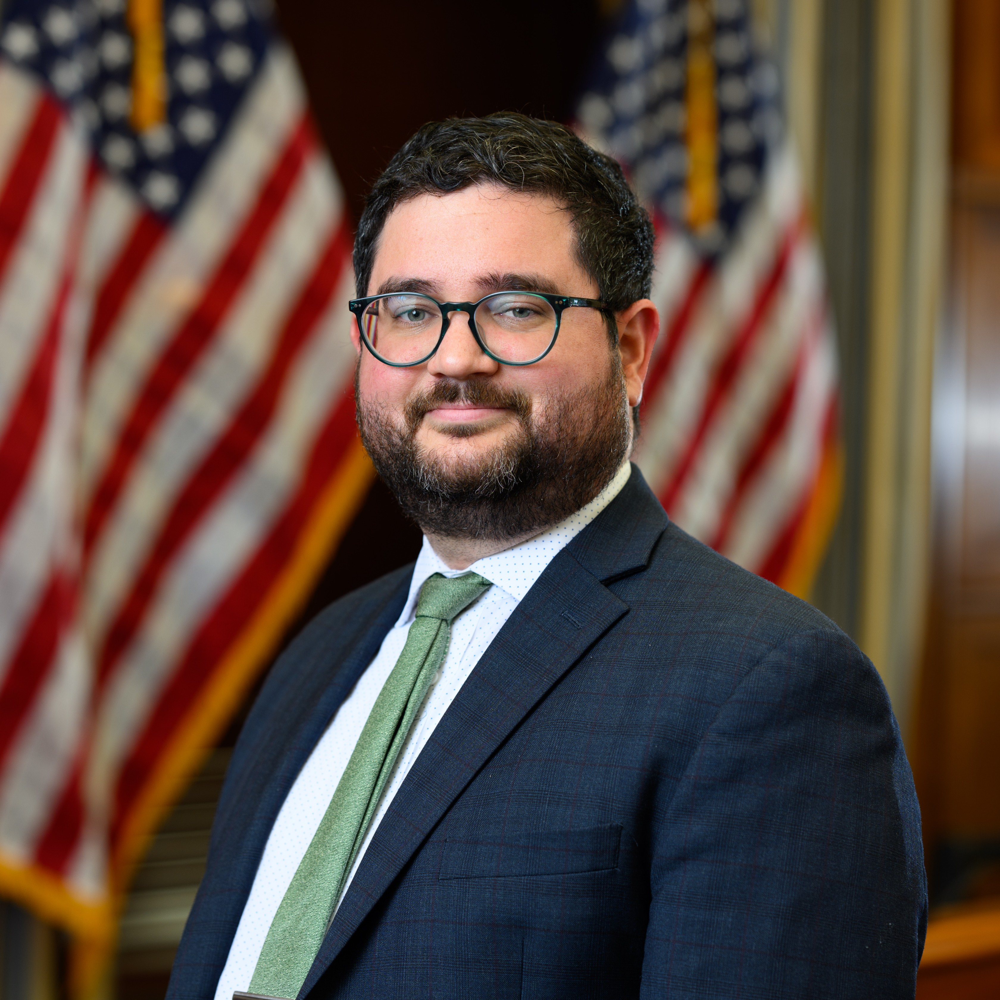
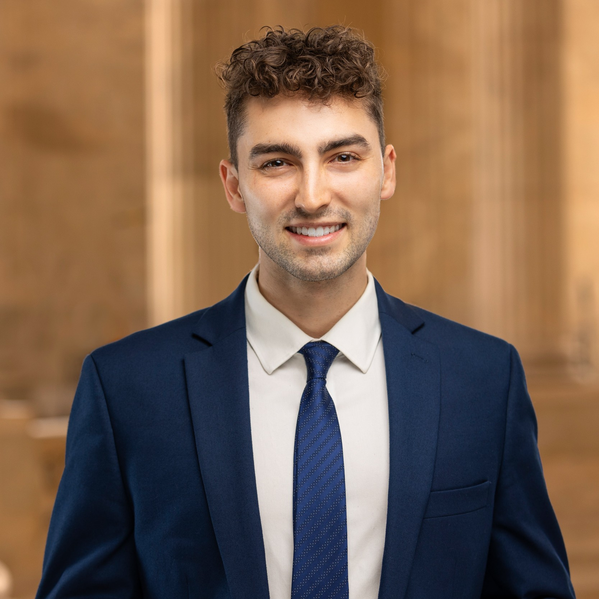

Tentative schedule, subject to change.

## Schedule At a Glance

+-------------------+------------------------------------------------------------------------------------+
| 8:00am - 8:45am   | Check-in & Coffee                                                                  |
+-------------------+------------------------------------------------------------------------------------+
| 8:45am - 9:00am   | Welcome and Opening Remarks                                                        |
+-------------------+------------------------------------------------------------------------------------+
| 9:00am - 10:00am  | Opening Panel: *Data Privacy and the Public Interest: Where Policy Meets Practice* |
+-------------------+------------------------------------------------------------------------------------+
| 10:00am - 10:15am | Coffee & Tea Break                                                                 |
+-------------------+------------------------------------------------------------------------------------+
| 10:15am - 12:00pm | Session 1: New Methods for Differentially Private Estimation and Learning          |
+-------------------+------------------------------------------------------------------------------------+
| 12:00pm - 1:30pm  | Lunch                                                                              |
+-------------------+------------------------------------------------------------------------------------+
| 1:30pm - 3:15pm   | Session 2: Rethinking Privacy: Concepts, Metrics, and Use Cases                    |
+-------------------+------------------------------------------------------------------------------------+
| 3:15pm - 3:30pm   | Coffee & Tea Break                                                                 |
+-------------------+------------------------------------------------------------------------------------+
| 3:30pm - 5:00pm   | Lightning Talks and Poster Session                                                 |
+-------------------+------------------------------------------------------------------------------------+
| 5:00pm - 5:15pm   | Poster Awards & Day 1 Wrap-Up                                                      |
+-------------------+------------------------------------------------------------------------------------+
| 5:15pm - 7:00pm   | Networking Reception                                                               |
+-------------------+------------------------------------------------------------------------------------+

: Day 1 Monday, February 9th {tbl-colwidths="\[23,77\]"}

+-------------------+-------------------------------------------------------------------------------------------------------------------------------------+
| 8:00am - 9:00am   | Check-in & Coffee                                                                                                                   |
+-------------------+-------------------------------------------------------------------------------------------------------------------------------------+
| 9:00am - 10:00am  | Policy Panel: *Translating Privacy Technology into Privacy Law: How Privacy Researchers and Practitioners Can Support Policymakers* |
+-------------------+-------------------------------------------------------------------------------------------------------------------------------------+
| 10:00am - 10:15am | Coffee & Tea Break                                                                                                                  |
+-------------------+-------------------------------------------------------------------------------------------------------------------------------------+
| 10:15am - 11:45am | Session 3: Regulatory Realities of Privacy and Data Protection                                                                      |
+-------------------+-------------------------------------------------------------------------------------------------------------------------------------+
| 11:45am - 1:00pm  | Lunch                                                                                                                               |
+-------------------+-------------------------------------------------------------------------------------------------------------------------------------+
| 1:00pm - 2:45pm   | Session 4: From PETs to Practice: Infrastructure and Applications                                                                   |
+-------------------+-------------------------------------------------------------------------------------------------------------------------------------+
| 2:45pm - 3:00pm   | Conference Wrap-Up                                                                                                                  |
+-------------------+-------------------------------------------------------------------------------------------------------------------------------------+

: Day 2 Tuesday, February 10th {tbl-colwidths="\[23,77\]"}

## Full Program

### Day 1: Mon. Feb. 9, 2026

+-------------------+-----------------------------------------------------------------------------------------------------------------------------------------------------------------------------------------------------------------------------------------------------------------------------------------------------------------------+------+
| 8:00am - 8:45am   | Check-in & Coffee                                                                                                                                                                                                                                                                                                     |      |
+-------------------+-----------------------------------------------------------------------------------------------------------------------------------------------------------------------------------------------------------------------------------------------------------------------------------------------------------------------+------+
| 8:45am - 9:00am   | Welcome and Opening Remarks                                                                                                                                                                                                                                                                                           |      |
+-------------------+-----------------------------------------------------------------------------------------------------------------------------------------------------------------------------------------------------------------------------------------------------------------------------------------------------------------------+------+
| 9:00am - 10:00am  | Opening Panel: “Data Privacy and the Public Interest: Where Policy Meets Practice”                                                                                                                                                                                                                                    |      |
|                   |                                                                                                                                                                                                                                                                                                                       |      |
|                   | Moderator: Sharon Gibbons, Co-founder, Augusta Griffin                                                                                                                                                                                                                                                                |      |
|                   |                                                                                                                                                                                                                                                                                                                       |      |
|                   | Panelists (bios are found at the [end of the program](#opening-panel-participants)):                                                                                                                                                                                                                                  |      |
|                   |                                                                                                                                                                                                                                                                                                                       |      |
|                   | -   Yaw Etse, *VP of Data Engineering, Capital One*                                                                                                                                                                                                                                                                   |      |
|                   | -   Joe Calandrino, *Assistant Professor, Carnegie Mellon University*                                                                                                                                                                                                                                                 |      |
|                   | -   Naomi Lefkovitz, *Senior Fellow, Future of Privacy Forum*                                                                                                                                                                                                                                                         |      |
+-------------------+-----------------------------------------------------------------------------------------------------------------------------------------------------------------------------------------------------------------------------------------------------------------------------------------------------------------------+------+
| 10:00am - 10:15am | Coffee & Tea Break                                                                                                                                                                                                                                                                                                    |      |
+-------------------+-----------------------------------------------------------------------------------------------------------------------------------------------------------------------------------------------------------------------------------------------------------------------------------------------------------------------+------+
| 10:15am - 12:00pm | Session 1: New Methods for Differentially Private Estimation and Learning                                                                                                                                                                                                                                             |      |
|                   |                                                                                                                                                                                                                                                                                                                       |      |
|                   | -   S1.1: **Differential Privacy Guarantees in Small Area Estimation** - Soumojit Das\* and Jörg Drechsler                                                                                                                                                                                                            |      |
|                   | -   S1.2: **Differential Privacy for Network Connectedness Indices** - Tom A. Rutter, Yuxin Liu, and M. Amin Rahimian\*                                                                                                                                                                                               |      |
|                   | -   S1.3: **Privacy Amplification for Synthetic Data Using Range Restriction** - Jingchen Hu, Matthew R. Williams\*, Terrance D. Savitsky                                                                                                                                                                             |      |
|                   | -   S1.4: **Measuring Income Mobility Under Differential Privacy** - Brett Mullins\* and Miguel Fuentes                                                                                                                                                                                                               |      |
|                   | -   S1.5: **A Practical Guide to Differentially Private Deep Learning Using the Pseudo Posterior Mechanism** - Alexander J. Preiss, Amanda Konet, Robert Chew\*, Matthew R. Williams, Elan A. Segarra, David H. Oh, Erin Boon, Terrance D. Savitsky                                                                   |      |
+-------------------+-----------------------------------------------------------------------------------------------------------------------------------------------------------------------------------------------------------------------------------------------------------------------------------------------------------------------+------+
| 12:00pm - 1:30pm  | Lunch                                                                                                                                                                                                                                                                                                                 |      |
+-------------------+-----------------------------------------------------------------------------------------------------------------------------------------------------------------------------------------------------------------------------------------------------------------------------------------------------------------------+------+
| 1:30pm - 3:15pm   | Session 2: Rethinking Privacy: Concepts, Metrics, and Use Cases                                                                                                                                                                                                                                                       |      |
|                   |                                                                                                                                                                                                                                                                                                                       |      |
|                   | -   S2.1: **From Privacy Enhancing Technologies to Purpose-Limiting Technologies** - Gabriel Kaptchuk\*                                                                                                                                                                                                               |      |
|                   | -   S2.2: **Having Confidence in My Confidence Intervals: How Data Users Engage with Privacy-Protected Wikipedia Data** - Harold Triedman\*, Jayshree Sarathy, Priyanka Nanayakkara, Rachel Cummings, Gabriel Kaptchuk, Sean Kross, Elissa M. Redmiles                                                                |      |
|                   | -   S2.3: **Towards A Taxonomy of Privacy for Digital Currencies in Regulated Environments** - François-Xavier Wicht\*, Christian Sillaber, Mirjam Eggen, Christian Cachin                                                                                                                                            |      |
|                   | -   S2.4: **Do You Really Need Public Data? Surrogate Public Data for Differential Privacy on Tabular Data** - Shlomi Hod, Lucas Rosenblatt\*, Julia Stoyanovich                                                                                                                                                      |      |
|                   | -   S2.5: **What Does ε=1 Actually Mean in Practice? Building A Registry to Find Out** - James Honaker, Gary Howarth, Andrew Gruen\*                                                                                                                                                                                  |      |
+-------------------+-----------------------------------------------------------------------------------------------------------------------------------------------------------------------------------------------------------------------------------------------------------------------------------------------------------------------+------+
| 3:15pm - 3:30pm   | Coffee & Tea Break                                                                                                                                                                                                                                                                                                    |      |
+-------------------+-----------------------------------------------------------------------------------------------------------------------------------------------------------------------------------------------------------------------------------------------------------------------------------------------------------------------+------+
| 3:30pm - 5:00pm   | Lightning Talks and Posters                                                                                                                                                                                                                                                                                           |      |
|                   |                                                                                                                                                                                                                                                                                                                       |      |
|                   | -   **P.01: Privacy Preserving Data Access Primitives for Social Platform Data** - Kyle Resnik, Christine Task\*, Doyle Groves, Bennett Hillenbrand                                                                                                                                                                   |      |
|                   | -   **P.02: Optimal Resolution of a Data Sharing Trilemma: Statistical Power, Sample Complexity, And Privacy Budget** - Yuxin Liu\*, M. Amin Rahimian, and Marios Papachristou                                                                                                                                        |      |
|                   | -   **P.03: Layered, Overlapping, and Inconsistent: A Large-Scale Analysis of the Multiple Privacy Policies and Controls of U.S. Banks** - Lu Xian\*, Van Hong Tran, Lauren Lee, Meera Kumar, Yichen Zhang, and Florian Schaub                                                                                        |      |
|                   | -   **P.04: Valid Inference Under Data Swapping** - Kevin Eng\*, Ruobin Gong, and Minge Xie                                                                                                                                                                                                                           |      |
|                   | -   **P.05: Fully Synthetic Data for the American Community Survey** - Michael Freiman\*, Evan Totty, and Aref Dajani                                                                                                                                                                                                 |      |
|                   | -   **P.06: From Pilot to Implementation: Privacy Enhancing Technology in Action** - Lisa B. Mirel\*                                                                                                                                                                                                                  |      |
|                   | -   **P.07: On The Rival Nature of Data Use in the Context of Privacy – Legal Applications** - Ayelet Gordon-Tapiero, Muhammad Saad\*, Katrina Ligett, and Kobbi Nissim                                                                                                                                               |      |
|                   | -   **P.08: Sites Of Indeterminacy: A Comparative Study of Differential Privacy Deployment in Public and Private Institutions** - Jae June Lee\* and Daniel Susser                                                                                                                                                    |      |
|                   | -   **P.09: Differentially Private Linear Regression and Synthetic Data Generation with Statistical Guarantees** - Shurong Lin\*                                                                                                                                                                                      |      |
|                   | -   **P.10: Data Governance Transformation: Now Is the Time to Revisit Data Governance Policy** - Jacob M. Pasner\*                                                                                                                                                                                                   |      |
|                   | -   **P.11: The Gift of Federal Statistics: Reframing the Givens in U.S. Public Sector Data Access** - Jayshree Sarathy\* and Danah Boyd                                                                                                                                                                              |      |
|                   | -   **P.12: Democratizing Innovation Microdata: How Synthetic Public Use Files Can Address the Credibility Crisis in Applied Economics** - Audrey Kindlon, Jorge Cisneros, Timothy Wojan\*, Matt Williams, Jennifer Ozawa, Robert Chew, Kimberly Janda, Timothy Navarro, Michael Floyd, DJ Streat, and Heather Madray |      |
|                   | -   **P.13: Differentially Private Geodesic Regression** - Aditya Kulkarni\*, Carlos Soto                                                                                                                                                                                                                             |      |
+-------------------+-----------------------------------------------------------------------------------------------------------------------------------------------------------------------------------------------------------------------------------------------------------------------------------------------------------------------+------+
| 5:00pm - 5:15pm   | Announce Poster Winners & Wrap Day                                                                                                                                                                                                                                                                                    |      |
+-------------------+-----------------------------------------------------------------------------------------------------------------------------------------------------------------------------------------------------------------------------------------------------------------------------------------------------------------------+------+
| 5:15pm - 7:00pm   | Networking Reception                                                                                                                                                                                                                                                                                                  |      |
+-------------------+-----------------------------------------------------------------------------------------------------------------------------------------------------------------------------------------------------------------------------------------------------------------------------------------------------------------------+------+

### Day 2: Tues. Feb. 10, 2026

+-------------------+---------------------------------------------------------------------------------------------------------------------------------------------------------------------------------------------------------------------------------------------------------------------------------+------+
| 8:00am - 9:00am   | Check-in & Coffee                                                                                                                                                                                                                                                               |      |
+-------------------+---------------------------------------------------------------------------------------------------------------------------------------------------------------------------------------------------------------------------------------------------------------------------------+------+
| 9:00am - 10:00am  | Policy Panel: “Translating Privacy Technology into Privacy Law: How Privacy Researchers and Practitioners Can Support Policymakers”                                                                                                                                             |      |
|                   |                                                                                                                                                                                                                                                                                 |      |
|                   | Moderator: Tatiana Rice, Senior Director for U.S. Legislation, Future of Privacy Forum                                                                                                                                                                                          |      |
|                   |                                                                                                                                                                                                                                                                                 |      |
|                   | Panelists (bios are found at the [end of the program](#policy-panel-participants)):                                                                                                                                                                                             |      |
|                   |                                                                                                                                                                                                                                                                                 |      |
|                   | -   Alan McQuinn, Professional Staff Member, U.S. House of Representatives                                                                                                                                                                                                      |      |
|                   | -   Dylan Irlbeck, Legislative Assistant, Congresswoman Lori Trahan                                                                                                                                                                                                             |      |
+-------------------+---------------------------------------------------------------------------------------------------------------------------------------------------------------------------------------------------------------------------------------------------------------------------------+------+
| 10:00am - 10:15am | Coffee & Tea Break                                                                                                                                                                                                                                                              |      |
+-------------------+---------------------------------------------------------------------------------------------------------------------------------------------------------------------------------------------------------------------------------------------------------------------------------+------+
| 10:15am - 11:45am | Session 3: Regulatory Realities of Privacy and Data Protection                                                                                                                                                                                                                  |      |
|                   |                                                                                                                                                                                                                                                                                 |      |
|                   | -   S3.1: **What Regulators Actually Look for in Privacy Programs: Lessons From HIPAA, OCR, DOJ Bulk Data, And Global Enforcement Trends** - Bridget M. Bratt\* and Joseph A. Emerson                                                                                           |      |
|                   | -   S3.2: **How to Think About End-To-End Encryption And AI: Training, Inference, Disclosure, And Consent** - Mallory Knodel\*, Andrés Fabrega, Daniella Ferrari, Jacob Leiken, Betty Li Hou, Derek Yen, Sam de Alfaro, Kyunghyun Cho, and Sunoo Park                           |      |
|                   | -   S3.3: **Measuring User Responses to Online Age Verification** - Yanzi Veronica Lin\*, Cheng Zhang, Madelyne Xiao, Weiqian Zhang, Vivianna Lieu, Wenchao Hu, Lorrie Faith Cranor, and Sarah Scheffler                                                                        |      |
|                   | -   S3.4: **Privacy and Safety Experiences and Concerns of U.S. Women Using Generative AI For Seeking Sexual And Reproductive Health Information** - Ina Kaleva\*, Xiao Zhan, Ruba Abu-Salma, and Jose Such                                                                     |      |
+-------------------+---------------------------------------------------------------------------------------------------------------------------------------------------------------------------------------------------------------------------------------------------------------------------------+------+
| 11:45am - 1:00pm  | Lunch                                                                                                                                                                                                                                                                           |      |
+-------------------+---------------------------------------------------------------------------------------------------------------------------------------------------------------------------------------------------------------------------------------------------------------------------------+------+
| 1:00pm - 2:45pm   | Session 4: From PETs to Practice: Infrastructure and Applications                                                                                                                                                                                                               |      |
|                   |                                                                                                                                                                                                                                                                                 |      |
|                   | -   S4.1: **Full-Stack Output Privacy Risk Assessment** - Shlomi Hod\*, and Jayshree Sarathy\*                                                                                                                                                                                  |      |
|                   | -   S4.2: **Benchmarking Differential Privacy for Applied Public Policy Analysis** - Aaron R. Williams\*, Andrés F. Barrientos, Claire McKay Bowen, and Joshua Snoke                                                                                                            |      |
|                   | -   S4.3: **Natural Language Access to Privacy-Preserving Data: Integrating the Model Context Protocol with Differentially Private Query Engines** - Bennett Hillenbrand\*, Andrew Gruen, James Honaker, and Sharon Gibbons                                                     |      |
|                   | -   S4.4: **The Secure Query Service: A Novel Application for Providing Privacy-Preserving Aggregate Statistics on Individual Income Tax Data** - Joshua Snoke\*                                                                                                                |      |
|                   | -   S4.5: **Privy: Operationalizing Privacy Policy With AI-Assisted Privacy Impact Assessment Workflow** - Hao-Ping (Hank) Lee\*, Yu-Ju Yang, Matthew Bilik, Isadora Krsek, Thomas Serban von Davier, Kyzyl Monteiro, Jason Lin, Shivani Agarwal, Jodi Forlizzi, and Sauvik Das |      |
+-------------------+---------------------------------------------------------------------------------------------------------------------------------------------------------------------------------------------------------------------------------------------------------------------------------+------+
| 2:45pm - 3:00pm   | Conference Wrap Up                                                                                                                                                                                                                                                              |      |
+-------------------+---------------------------------------------------------------------------------------------------------------------------------------------------------------------------------------------------------------------------------------------------------------------------------+------+

## Panelist Information

### Opening Panel Participants {#opening-panel-participants}

::: {layout="[[1,3]]"}

**Sharon Gibbons**\
With over two decades of experience navigating the intersection of technology and collaboration, Sharon Gibbons is an expert in end-to-end privacy policy and deployment. As co-founder of Augusta Griffin, she creates novel solutions for sensitive data domains by uniting global providers and specialist teams. Her leadership experience includes a transformative five-year tenure at Meta, where she revolutionized academic partnerships and scaled research operations, and a decade at Technicolor leading marketing innovation strategy. Most recently, Sharon served as Director of Community Engagement for the OpenDP project, driving worldwide participation in open-source privacy tools.
:::

::: {layout="[[1,3]]"}

**Yaw Etse**\
Yaw Etse is the Vice President of Data Engineering at Capital One, where he leads the Data Governance organization in Enterprise Data focusing on data anonymization, scalability, and operational efficiency. His role at Capital One involves driving innovative solutions and helping the company stay ahead in the competitive financial sector, especially through his involvement in projects on synthetic data and differential privacy. Yaw is actively collaborating with our Applied Researchers and academic engagement partners with Harvard on OpenDP and MIT on the Future of Data, to leverage research and advancements in secure data processing and privacy enhancing technologies here at Capital One.

<!-- Prior to Yaw's tenure at Capital One, Yaw was the VP of Engineering at Invitae, a biotech firm specializing in clinical DNA sequencing, where he led R&D in DNA sequencing and lab automation. Earlier, he served as an Engineering leader at American Express, and the CTO of Promise Financial and co-founded DigiFi, a machine learning-based credit underwriting platform. -->
:::

::: {layout="[[1,3]]"}

**Joseph Calandrino**\
Joseph Calandrino is an assistant professor at Carnegie Mellon University affiliated with the Department of Engineering and Public Policy, the School of Computer Science, and the CyLab Security and Privacy Institute.  His research falls at the intersection of computer science with public policy.  He previously served as acting chief science and technology advisor and acting chief AI officer at the U.S. Department of Justice and, for more than eight years, as research director in the Federal Trade Commission's Bureau of Consumer Protection.  He received his doctorate in Computer Science from Princeton University and a BS in Computer Science and Mathematics from the University of Virginia.
:::

::: {layout="[[1,3]]"}
<!--  -->

**Naomi Lefkovitz**\
Bio coming soon.
:::

### Policy Panel Participants {#policy-panel-participants}

::: {layout="[[1,3]]"}

**Tatiana Rice**\
Tatiana Rice is the Senior Director of Legislation and Regulation at the Future of Privacy Forum. She helps lawmakers, industry leaders, and civil society navigate the evolving landscape of data privacy, AI, and emerging technology regulation and policy. She leads FPF’s strategic legislative and regulatory engagement at the state and federal levels, providing expert analysis, research, and guidance to support informed decision-making on AI policy and governance. Prior to joining FPF, Tatiana was at Shook, Hardy, & Bacon LLP, where she led biometric compliance efforts and supported industry clients in managing data privacy compliance, litigation, and investigations.
:::

::: {layout="[[1,3]]"}

**Alan McQuinn**\
Alan McQuinn is a Professional Staff Member for the Research & Technology Subcommittee of the House Committee on Science, Space, and Technology. He advises Committee Members on a variety of issues related to information communications technology, such as cybersecurity, privacy, artificial intelligence, advanced manufacturing, and quantum information science. Alan McQuinn was previously a senior policy analyst at the Information Technology and Innovation Foundation. McQuinn has a Master’s in Public Policy from the McCourt School at Georgetown University and a B.S. from the University of Texas at Austin.
:::

::: {layout="[[1,3]]"}

**Dylan Irlbeck**\
Dylan Irlbeck is a technologist focused on making government work better. Dylan currently serves as Legislative Assistant for Congresswoman Lori Trahan (MA-03), a senior Democrat on the House Energy & Commerce Committee, covering technology, consumer protection, and college sports issues. Dylan was previously a TechCongress fellow, serving with the Senate Finance and House Oversight Committees where he worked on policy related to government modernization, artificial intelligence, and antitrust. Earlier in his career, Dylan served as a Coding it Forward Fellow, developing public interest technology for the federal government.
:::